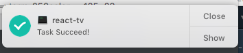

# sayok

```shell
npm i --save-dev sayok
```

or

```shell
yarn add --dev sayok
```

In your `package.json` just add `&& sayok` at the end of task.

```json
"scripts": {
  "build": "node scripts/rollup/build.js && sayok",
```



## Credits

From mikaelbr/node-notifier <3
